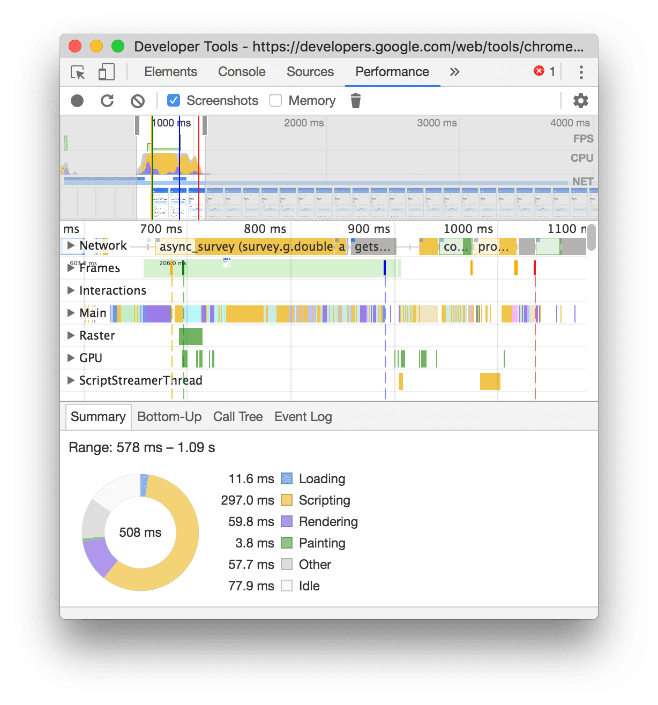

Previously, we outlined the general process of browser rendering. It's important to understand its relationship with frontend performance optimization. So, let's delve into how to analyze web pages based on various rendering processes and explore optimization techniques.

## Performance Analysis

### Tools

The Chrome Developer Tools' Timeline. ([Link to Usage Guide](https://developers.google.com/web/tools/chrome-devtools/evaluate-performance/timeline-tool))

### Metrics

**60fps**

Most devices today have a screen refresh rate of 60 times per second. Synchronizing browser rendering with the device's screen refresh rate ensures a smooth user experience. This implies that each frame's rendering task should be completed within 16ms.

#### Critical Rendering Path
The Critical Rendering Path in a web browser is the sequence of steps the browser takes to convert HTML, CSS, and JavaScript into the pixels on the screen. It includes processes such as parsing HTML, constructing the DOM (Document Object Model), calculating styles, laying out elements, painting pixels, and rendering the final website. Optimizing the critical rendering path is essential for improving website performance and ensuring fast loading times for users. This involves techniques such as minimizing render-blocking resources, optimizing CSS and JavaScript, and prioritizing visible content to be rendered first.
### Preliminary Diagnosis Using Chrome's Timeline

The image above shows the timeline analysis panel. Key points from top to bottom:

1. Use the round button on the left of the control panel to start/stop recording the page rendering process. The right side provides recording options.
2. The Overview window consists of FPS, CPU, and NET charts.
   - FPS: Displays frames per second. Higher green bars indicate higher FPS. Red squares above indicate long frames, implying possible stuttering.
   - CPU: Illustrates CPU resource consumption for different events.
   - NET: Shows resource retrieval status.
     - Blue: HTML
     - Yellow: Scripts
     - Purple: Stylesheets
     - Media Files: Green
     - Other Resources: Gray
3. The third area from the top downward displays three lines. Blue vertical lines denote DOMContentLoaded events, green lines indicate the start of painting, and red lines represent the load event. Refer to [this documentation](https://developers.google.com/web/tools/chrome-devtools/profile/evaluate-performance/performance-reference) for detailed event descriptions.

For accurate results, it's recommended to use incognito mode, clear browser cache, and avoid irrelevant actions during analysis.

Try recording the timeline while viewing this blog (unoptimized, please bear with it). You'll notice significant room for improvement in the webpage's performance, with many long frames detected by FPS. Clicking on detailed time types reveals more information.

Additionally, enabling screenshots and JS profiling captures snapshots during recording and allows analysis and tracking of time-consuming JS functions in the timeline. Refer to the official documentation for more details.

### Other Analysis Methods

- Use Navigation Timing to evaluate the Critical Rendering Path. ([Detailed Explanation Here](https://developers.google.com/web/fundamentals/performance/critical-rendering-path/measure-crp)) Additionally, Google Analytics can be utilized for evaluation and optimization suggestions.
- Utilize logging points.

## Optimization Approaches

Considering rendering aspects:

### Optimize Critical Path

Reduce initial blank screen time by analyzing which resources are critical and which can be deferred.

- JavaScript: Asynchronously or lazily load JS to avoid long-running scripts.
- CSS: Place CSS in the head, avoid using CSS imports, and inline critical CSS to prevent render-blocking.

### Minimize Reflow and Repaint

- Rendering scenarios:
  - Modifying DOM elements' layout styles (affecting position or size):
    - JS/CSS -> Calculate Style -> Layout -> Paint -> Composite (render layer merging)
  - Modifying DOM's paint-only properties:
    - JS/CSS -> Calculate Style -> Paint -> Composite
  - Modifying non-style and non-drawing DOM properties (transform and opacity):
    - JS/CSS -> Calculate Style -> Composite

(Detailed CSS property triggers can be found [here](http://csstriggers.com/)). Minimize occurrences of the first and second scenarios.

### Optimization Techniques

- JS:
  - Optimization methods:
    - Use requestAnimationFrame for animations.
    - Offload time-consuming JS to web workers.
    - Break down DOM updates into smaller tasks distributed across multiple frames.
- CSS:
  - Optimization techniques:
    - Reduce CSS selector complexity, use class-based approaches like BEM.
    - Minimize the number of styles requiring computation.
- DOM Operations:
  - Intelligent browsers batch all changes into a queue and execute them together to minimize reflows. Avoid reading and writing operations together. Group multiple reads (or writes) of the same element.
  - Combine multiple style changes for a single element by modifying classes to trigger a single repaint.
- Additional methods for rendering performance improvement:
  - window.requestAnimationFrame(): Executes certain code on the next repaint. Useful for page scroll listeners or web animations.
  - window.requestIdleCallback(): Executes a callback only when there's idle time at the end of a frame.

References:
[Google's Latest Developer Tools Documentation](https://developers.google.com/web/tools/chrome-devtools/)