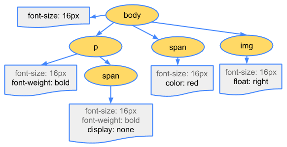

As frontend engineers, our daily work revolves around interacting with web browsers. To optimize the performance of web pages, it's crucial to understand the underlying principles of browser operation. With the aim of frontend optimization and the question in mind—what happens from entering a URL into the address bar to the complete rendering of a webpage?—I've delved into learning about the rendering principles of browsers. Here's a summary of my findings.

## Main Rendering Process of Browsers (Web Page Generation Process)

1. HTML parsing to generate the DOM tree.
2. CSS code transformation into CSSOM.
3. DOM and CSSOM merge to form the render tree.
4. Browser performs layout based on the render tree.
5. Rendering.

## Detailed Process

### Parsing

HTML parsing involves transformation, tokenization, lexical analysis, and DOM construction. The final output is the Document Object Model (DOM). Let's dive into it with the following diagram:

CSS parsing process is similar to HTML parsing:

The final product of CSS parsing is CSSOM, roughly like this:

### Render Tree Generation

DOM and CSSOM merge to form the render tree. This rendering only includes nodes required for rendering the page and the style information of these visible contents. The process involves traversing every visible node starting from the root node of the DOM tree, finding matching CSSOM rules for each visible node, applying these rules, and finally generating a render tree consisting of visible nodes, along with their content and computed styles.

### Layout

Before the browser can draw, knowing only the styles of nodes isn't sufficient; their positions and sizes must be determined. This step is also called reflow. The layout process outputs a box model. Additionally, since the layout of elements on a page is usually relative, a change in the size or position of one element may affect the layout of other elements.

### Painting

Once the render tree and layout are complete, the browser starts painting. Generally, the painting process occurs in multiple layers. After each layer is drawn, the browser merges all layers in a logical order to display them on the screen.

> The painting involves two main tasks: 1) creating a series of draw calls 2) filling pixels. The latter is commonly referred to as rasterization.

### Wait, Are There Dependencies Among These Steps? What's the Actual Process Like?

"How browser works" emphasizes the following:

> It's worth noting that this is a progressive process. To achieve a better user experience, the rendering engine strives to display content on the screen as quickly as possible. It doesn't have to wait until the entire HTML document is parsed to start building the render tree and setting layout. While continuously receiving and processing additional content from the network, the rendering engine parses and displays parts of the content.

Additionally, according to Google's developer documentation:

1. CSS is considered a blocking rendering resource. Before CSSOM construction completes, the browser suspends rendering any already processed content.
   - Optimization: CSS should be downloaded to the client as early as possible to shorten the first rendering time. Additionally, use media types and media queries to unblock rendering.
2. JavaScript can query, modify DOM and CSSOM, and it can block DOM construction, delaying page rendering. Also, script execution may be blocked due to CSSOM.
   - This highlights the importance of script placement because encountering a script tag halts DOM construction until the script execution completes.
   - Optimization: Load JavaScript asynchronously to eliminate unnecessary JavaScript in the critical rendering path.
3. Not all resources are crucial for initial rendering. For example, whether images are loaded does not affect building the render tree or even painting the page.
4. A significant part of frontend optimization lies in optimizing the dependencies among HTML/CSS/JS.

References:

- [How browser works](https://www.html5rocks.com/zh/tutorials/internals/howbrowserswork/)
- [Browser - Critical Rendering Path](https://developers.google.com/web/fundamentals/performance/critical-rendering-path/)